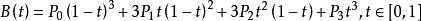

# Canvas 手写板的实现与优化（施工中）

最近在公司接了几个项目，都和 Canvas 手绘手写有关的，有历史遗留项目，还有要从头写的新需求。之前对 Canvas 的认知比较少，只写过一个带动画的圆环百分比小组件（[GitHub - ElizurHz/vue-percentage: 圆环百分比小组件](https://github.com/ElizurHz/vue-percentage)），是定好数据后再把它画到 Canvas 上，而手写板是第一次接触。

本文所涉及的代码是基于 [szimek/signature_pad](https://github.com/szimek/signature_pad) 这个开源组件进行改造的，所以下面会对源码进行一些解析，也会讲解一些我自己对其进行改造的经验。

## Canvas 相关基础知识

本文列举一些本文涉及到的必备知识和常用的 API，API 具体内容不过多赘述，详情可以在 [Canvas - Web API 接口参考 | MDN](https://developer.mozilla.org/zh-CN/docs/Web/API/Canvas_API) 查看。

### 基本用法

`<canvas>` 是 HTML5 中的一个标签，我们可以以如下方式书写：

```
<canvas id="test" width="150" height="150"></canvas>
```

其中 width 和 height 是 canvas 的必需属性，否则无法看到绘制的内容。在初始化时我们也可以通过 `document.getElementById` 的方式获取 DOM 节点，并设置其 width 和 height 属性。**【注意：在已经绘制过的 canvas 上重设这两个属性会导致已绘制内容被清空】**

如需在 canvas 上绘制，我们需要获取它的“渲染上下文 (The rendering context)”

```
const test = document.getElementById('test')
const ctx = test.getContext('2d')
```

### 绘制

在 Canvas 中我们定位使用的是坐标系，(0, 0) 代表的是最左上的点，可视区域最右下的点为 (width, height)。

- context.clearRect(x, y, width, height): 以 (x, y) 为基准（左上角的点），清空长为 width、宽为 height 的矩形中所绘制的所有内容
- context.eginPath(): 新建路径
- context.closePath(): 闭合路径
- context.stroke(): 绘制轮廓
- context.moveTo(x, y): 移动至点 (x, y)
- context.lineTo(x, y): 绘制一条从当前点到 (x, y) 的直线
- context.bezierCurveTo(cp1x, cp1y, cp2x, cp2y, x, y): 三次贝塞尔曲线

与图片相关的 API

- canvas.toBlob(): 当前 canvas 转化为 blob 对象，参数是一个回调函数，回调函数的参数就是 blob 对象。**回调函数是异步执行的！**
- canvas.toDataURL(): 转化为 base64 编码的 url。参数为图片格式，如 `'image/png'`。
- context.drawImage(): 把图片绘制到 canvas 上。它有三种使用方式，根据传参数量的不同会有不同的结果。详情见 [CanvasRenderingContext2D.drawImage() - Web API 接口参考 | MDN](https://developer.mozilla.org/zh-CN/docs/Web/API/CanvasRenderingContext2D/drawImage)。

### 贝塞尔曲线

[贝塞尔曲线 - 维基百科，自由的百科全书](https://zh.wikipedia.org/wiki/%E8%B2%9D%E8%8C%B2%E6%9B%B2%E7%B7%9A)


这里主要讲一下本文涉及到的三次贝塞尔曲线。它有起点、控制点 1、控制点 2、终点四个关键的点。

三次贝塞尔曲线的公式如下：



其中 t 为参数。使 t 逐渐从 0 增大到 1，即可通过这个方程式画出贝塞尔曲线。

### 事件

实现手写板，我们需要监听 Canvas 上的事件。由于我们可能是用鼠标去绘画，也可能是在触屏上绘画，所以我们除了监听鼠标事件之外，还需要监听触摸事件。

* mousedown/touchstart: 鼠标点击/开始触摸
* mousemove/touchmove: 鼠标/触摸移动中
* mouseup/touchend: 鼠标按键抬起/触摸结束(离开屏幕)

用这些 API 能满足大多数情况下的需求，但是现在出现了如 Surface Pen, Apple Pen 这类的手写笔，W3C 也有相应的新标准：PointerEvent ([PointerEvent - Web API 接口 | MDN](https://developer.mozilla.org/zh-CN/docs/Web/API/PointerEvent))。

> PointerEvent 接口代表了由 指针 引发的DOM事件的状态，包括接触点的位置，引发事件的设备类型，接触表面受到的压力等。
> 指针 是输入设备的硬件层抽象（比如鼠标，触摸笔，或触摸屏上的一个触摸点）。指针 能指向一个具体表面（如屏幕）上的一个（或一组）坐标。
> 指针的 击中检测 指浏览器用来检测 指针事件的目标元素的过程。大多数情况下，这个目标元素是由 指针的位置和元素在文章中的位置和分层共同决定的。

PointerEvent 的使用方法和 MouseEvent、TouchEvent 很类似，但有新增一些有用的 Properties:

* PointerEvent.pointerType:  这个 property 表示的是接触类型，有 3 种 string 类型的值 - mouse, pen, touch，分别代表鼠标、触控笔、触摸。
* PointerEvent.pressure: 这个 property 表示的是压力等级，数值范围是从 0 到 1 ，如果我们没有压感触控笔，或者使用鼠标，那么这个值默认是 0.5。

## 实现方案

* 历史遗留的项目中使用的是监听 move 的事件，每次都用 `lineTo()`和`stroke()`绘制出线条。这样做存在的问题是延迟很严重，笔画不跟笔，同时锯齿感也很严重。
* 参考了 [GitHub - szimek/signature_pad: HTML5 canvas based smooth signature drawing](https://github.com/szimek/signature_pad) 的实现方案，使用的是三次贝塞尔曲线，由于三次贝塞尔曲线的绘制需要至少 4 个点，分别是起点、控制点 1、控制点 2、终点，所以不能每次 move 都 `stroke()`进行绘制，而是需要记录点坐标并通过计算来绘制。实际效果比上面一种方法的延迟和锯齿感都好很多，**但是唯独在 Surface Book + Surface Pen 上的延迟感还是很明显，而前一代的 iPad Pro + Apple Pen 非常流畅，不知道有没有做过 Surface Pen 适配的大神能解答这个问题**。于是我就想能不能用 PointerEvent 来解决，但测试用的 Surface Book 是公司的开发机，我们小组只有一台，常常被其他开发和 QA 抢去使用，所以没有机会去验证这个问题。

## 具体实现

### Classes

这里用了两个辅助类，Bezier 是贝塞尔曲线，而 Point 是 canvas 中需要用到的点。

```
class Bezier {
  constructor(startPoint, control1, control2, endPoint) {
    this.startPoint = startPoint
    this.control1 = control1
    this.control2 = control2
    this.endPoint = endPoint
  }

  length = () => {
    var steps = 10
    var length = 0
    var px = void 0
    var py = void 0
  
    for (var i = 0; i <= steps; i += 1) {
      var t = i / steps
      var cx = this._point(t, this.startPoint.x, this.control1.x, this.control2.x, this.endPoint.x)
      var cy = this._point(t, this.startPoint.y, this.control1.y, this.control2.y, this.endPoint.y)
      if (i > 0) {
        var xdiff = cx - px
        var ydiff = cy - py
        length += Math.sqrt(xdiff * xdiff + ydiff * ydiff)
      }
      px = cx
      py = cy
    }
  
    return length
  }

  // cubic bezier
  _point = (t, start, c1, c2, end) => {
    return start * (1.0 - t) * (1.0 - t) * (1.0 - t) + 3.0 * c1 * (1.0 - t) * (1.0 - t) * t + 3.0 * c2 * (1.0 - t) * t * t + end * t * t * t
  }
}

export default Bezier
```

```
class Point {
  constructor(x, y, time) {
    this.x = x;
    this.y = y;
    this.time = time || new Date().getTime();
  }
  
  velocityFrom = (start) => {
    return this.time !== start.time ? this.distanceTo(start) / (this.time - start.time) : 1
  }

  distanceTo = (start) => {
    return Math.sqrt(Math.pow(this.x - start.x, 2) + Math.pow(this.y - start.y, 2))
  }

  equals = (other) => {
    return this.x === other.x && this.y === other.y && this.time === other.time
  }
}

export default Point
```

值得注意的是 Point 这个 Class 中，原作者加入了点绘制的时间，在原作者的项目中是有根据绘制速度调整笔画粗细的，但这个在我的改造中因为需求的缘故被去掉了。

### mousedown/touchstart 
### mousemove/touchmove
### mouseup/touchend

## 额外功能

### 单次手写保存成图片

### 删除、空格、换行、清空

### 所有的手写内容拼接并保存为一张图片
