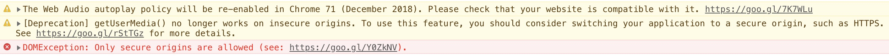
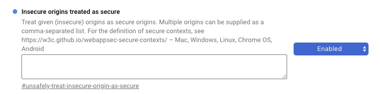

# HTML5 录音（施工中）

## WebRTC - getUserMedia()

## MediaRecorder

## Decode

## 兼容性与使用

[getUserMedia() 兼容性](https://caniuse.com/#search=getUserMedia)

[MediaRecorder() 兼容性](https://caniuse.com/#search=MediaRecorder)

Chrome 上需要 https 安全性验证，否则在使用 `getUserMedia()` 时会报如下的错误：

在本机调试的时候，我们可以使用 Chrome 的实验性功能来关闭验证：

- 首先在地址栏中输入 `chrome://flags/`
- 搜索 'Insecure origins treated as secure'
- 在文本框中输入调试的地址（可以是线上环境的地址，也可以是本机环境的地址），并将右侧的下拉选项选为 Enable
- 这时在底部 Chrome 会提示重启浏览器，点击重启即可

**在使用的时候一定要有录音设备，特别是台式机，否则会报错：**

